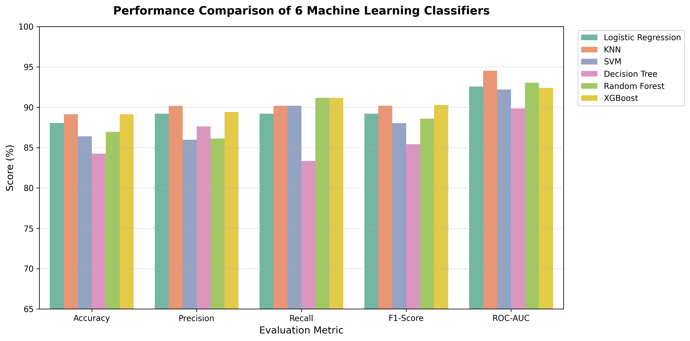
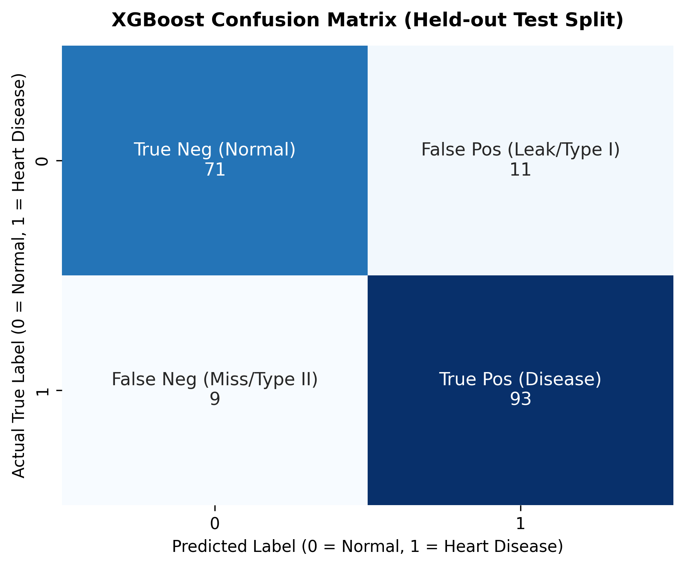
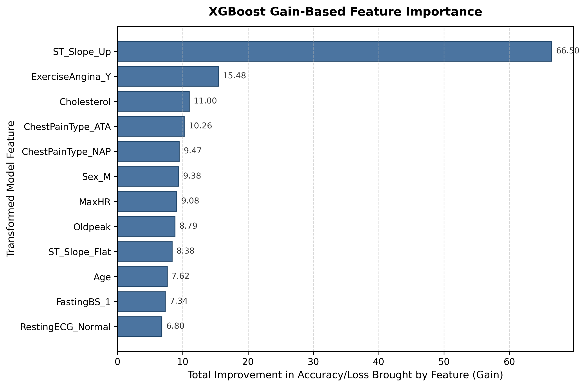

# ❤️ Heart Disease Prediction using Machine Learning

[](https://www.python.org/)
[](https://scikit-learn.org/)
[](https://xgboost.readthedocs.io/)
[](https://heart-disease-prediction-ml-fcpczxzgpyh4mjrmsk9qz9.streamlit.app/)
[](LICENSE)

An end-to-end supervised machine learning pipeline for cardiovascular risk prediction using physiological, metabolic, and electrocardiographic indicators.

🔗 **Live Application:** [https://heart-disease-prediction-ml-fcpczxzgpyh4mjrmsk9qz9.streamlit.app/](https://heart-disease-prediction-ml-fcpczxzgpyh4mjrmsk9qz9.streamlit.app/)

> **Project Origin:** Researched and developed during the **PYML Internship at Anveshan Foundation, Indira Gandhi Delhi Technical University for Women (IGDTUW)**.

---

## 📌 Table of Contents
- [Overview](#-overview)
- [Problem Formulation](#-problem-formulation)
- [Dataset Architecture](#-dataset-architecture)
- [Pipeline Architecture](#-pipeline-architecture)
- [Experimental Results & Benchmarks](#-experimental-results--benchmarks)
- [XGBoost Gain-Based Feature Importance](#-xgboost-gain-based-feature-importance)
- [Streamlit Application](#-streamlit-application)
- [Project Directory Structure](#-project-directory-structure)
- [Quickstart Guide](#-quickstart-guide)
- [Automated Verification Suite](#-automated-verification-suite)
- [Limitations & Future Scope](#-limitations--future-scope)
- [License & Citation](#-license--citation)

---

## 🔬 Overview

Cardiovascular diseases (CVDs) account for approximately 17.9 million deaths globally each year. Early identification of elevated risk profiles through standard clinical indicators allows for proactive medical and lifestyle interventions.

This repository provides a modular, leakage-free machine learning system that:
- Preprocesses mixed continuous and discrete clinical features via `ColumnTransformer`.
- Balances class distributions inside cross-validation folds using `imblearn.pipeline.Pipeline` and SMOTE.
- Tunes hyperparameters across six classification algorithms using 5-fold cross-validation (`RandomizedSearchCV`).
- Evaluates test-set performance across multiple metrics (Accuracy, Precision, Recall, F1-Score, ROC-AUC).
- Serves predictions via a cached, interactive **Streamlit** web interface.

---

## 🎯 Problem Formulation

Given a feature vector $\mathbf{x} \in \mathbb{R}^d$ representing patient vitals, metabolic markers, and exercise ECG findings, learn a classification function $f(\mathbf{x}) \to \hat{y} \in \{0, 1\}$ to predict cardiovascular disease presence:

- $\hat{y} = 0$: Normal / No heart disease detected
- $\hat{y} = 1$: Presence of heart disease

The primary optimization goal is to maximize classification accuracy and positive recall while ensuring zero data leakage between training and validation/test splits.

---

## 📊 Dataset Architecture

The dataset (`data/heart_final.csv`) consists of **918 patient observations** aggregated from 5 cardiovascular research cohorts (Cleveland, Hungarian, Switzerland, Long Beach VA, and Statlog).

### Feature Taxonomy (11 Features + 1 Target)

| Feature Name | Type | Description | Range / Categories |
| :--- | :--- | :--- | :--- |
| `Age` | Continuous | Age of patient | 18 – 100 years |
| `Sex` | Categorical | Biological sex | `M` (Male), `F` (Female) |
| `ChestPainType` | Categorical | Reported chest pain nature | `ASY` (Asymptomatic), `NAP` (Non-Anginal), `ATA` (Atypical Angina), `TA` (Typical Angina) |
| `RestingBP` | Continuous | Resting blood pressure on admission | 50 – 250 mm Hg |
| `Cholesterol` | Continuous | Serum cholesterol | 0 – 650 mm/dl (0 indicates clinical omission) |
| `FastingBS` | Binary | Fasting blood sugar > 120 mg/dl | `0` (Normal $\le 120$), `1` (Hyperglycemia $> 120$) |
| `RestingECG` | Categorical | Resting electrocardiogram findings | `Normal`, `LVH` (Left Ventricular Hypertrophy), `ST` (ST-T abnormality) |
| `MaxHR` | Continuous | Maximum heart rate achieved under stress | 50 – 230 bpm |
| `ExerciseAngina` | Categorical | Exercise-induced angina | `N` (No), `Y` (Yes) |
| `Oldpeak` | Continuous | ST depression induced by exercise vs. rest | -3.0 – 7.0 mm |
| `ST_Slope` | Categorical | Slope of peak exercise ST segment | `Up` (Upsloping), `Flat` (Flat), `Down` (Downsloping) |
| **`HeartDisease`** | **Target** | Disease presence | **`0` (Normal: 410 / 44.7%)**, **`1` (Disease: 508 / 55.3%)** |

---

## ⚙️ Pipeline Architecture

To prevent data leakage during scaling and oversampling, `ColumnTransformer`, `SMOTE`, and `Classifier` are encapsulated within a unified `imblearn.pipeline.Pipeline`. During 5-fold cross-validation, preprocessing and SMOTE are fitted **strictly inside each training fold**, insulating validation folds from out-of-fold contamination.

```
                    ┌──────────────────────────────────┐
                    │   Raw Dataset (heart_final.csv)  │
                    │         (918 patients)           │
                    └────────────────┬─────────────────┘
                                     │
                                     ▼
                    Stratified Train/Test Split (80% / 20%)
                                     │
              ┌──────────────────────┴──────────────────────┐
              │                                             │
      Training Set (734)                             Test Set (184)
              │                                      (Held out, untouched)
              ▼                                             │
   ┌──────────────────────────────────────────┐             │
   │  imblearn.pipeline.Pipeline              │             │
   │  ├── ColumnTransformer                   │             │
   │  │   ├── num: StandardScaler (5 features)│             │
   │  │   └── cat: OneHotEncoder (6 features) │             │
   │  ├── SMOTE(random_state=42)              │             │
   │  └── Classifier (XGBoost / LR / RF / etc)│             │
   └──────────────────┬───────────────────────┘             │
                      │                                     │
                      ▼                                     │
           RandomizedSearchCV (5-fold CV)                   │
         (Preprocessing & SMOTE executed                    │
          independently inside each fold)                   │
                      │                                     │
                      ▼                                     │
             Best XGBoost Pipeline                          │
                      │                                     │
                      ▼                                     │
           Final Test Evaluation ◄──────────────────────────┘
                      │
                      ▼
       Serialize Artifacts & Metrics
       ├── models/xgboost_pipeline.pkl
       └── models/model_metrics.json
```

---

## 📈 Experimental Results & Benchmarks

### Multi-Experiment Methodology Tracking

| Experiment Configuration | Methodology & Preprocessing Details | XGBoost Test Accuracy |
| :--- | :--- | :--- |
| **Experiment 1 (Internship Baseline)** | Initial Colab exploratory setup | **86.41%** |
| **Experiment 2 (Internship Tuned Notebook)** | Notebook RandomizedSearchCV parameter search | **87.50%** |
| **Experiment 3 (Leakage-Safe Refactored Pipeline)** | Fold-isolated `ImbPipeline` with discrete `FastingBS` OHE | **89.13%** |

---

### Comparative Evaluation across 6 Classifiers

Evaluated on the held-out test split ($n=184$, $20\%$ stratified sample):

| Classifier Algorithm | Accuracy | Precision | Recall | F1-Score | ROC-AUC | Best Hyperparameters |
| :--- | :---: | :---: | :---: | :---: | :---: | :--- |
| **XGBoost (Selected)** | **89.13%** | **89.42%** | **91.18%** | **90.29%** | **92.38%** | `n_estimators=300, max_depth=3, learning_rate=0.01, subsample=0.6, colsample_bytree=1.0, gamma=5` |
| **KNN** | 89.13% | 90.20% | 90.20% | 90.20% | 94.52% | `n_neighbors=15, metric='manhattan', weights='uniform'` |
| **Logistic Regression** | 88.04% | 89.22% | 89.22% | 89.22% | 92.55% | `C=0.1, penalty='l2', solver='lbfgs'` |
| **Random Forest** | 86.96% | 86.11% | 91.18% | 88.57% | 93.03% | `n_estimators=100, max_depth=5, min_samples_split=10, bootstrap=True` |
| **SVM (Support Vector Machine)** | 86.41% | 85.98% | 90.20% | 88.04% | 92.20% | `C=0.1, kernel='linear', gamma='scale'` |
| **Decision Tree** | 84.24% | 87.63% | 83.33% | 85.43% | 89.85% | `max_depth=3, criterion='gini', min_samples_split=5, min_samples_leaf=6` |

#### Model Selection Rationale:
Both **XGBoost** and **KNN** tied for highest test accuracy (**89.13%**). **XGBoost** was selected for production deployment because:
1. **High Positive Recall & F1-Score**: XGBoost achieved **91.18% recall** (identifying 93 of 102 positive test cases) and an **F1-score of 90.29%**, minimizing false-negative risk.
2. **Gain-Based Feature Interpretability**: Tree boosting provides direct feature gain attribution across transformed dummy variables.

---

### Benchmark Visualizations

| 6-Model Benchmark Comparison | XGBoost Test Confusion Matrix |
| :---: | :---: |
|  |  |

---

## 🔍 XGBoost Gain-Based Feature Importance

Feature importance was extracted directly from the underlying XGBoost booster via `importance_type='gain'`, mapped to the one-hot encoded feature space:



### Key Clinical Drivers:
1. **`ST_Slope_Up` & `ST_Slope_Flat`**: ST-segment dynamics during peak exercise represent the strongest split criteria for ischemic detection.
2. **`ChestPainType_ASY`**: Asymptomatic presentations coupled with abnormal exercise ECG form a distinct high-gain feature branch.
3. **`Oldpeak` & `ExerciseAngina_Y`**: Exercise-induced ST depression and exercise angina directly quantify reversible cardiac stress.

---

## 🖥️ Streamlit Application

The Streamlit web application (`app.py`) provides:
1. **Interactive Patient Risk Assessment**: Clinical input widgets for patient vitals, metabolic indicators, and ECG readings to generate real-time probability estimates.
2. **Model Performance & Benchmarks**: Live comparative tables, test confusion matrices, and dynamic gain-based feature importance visualization.

---

## 📁 Project Directory Structure

```
Heart-Disease-Prediction-ML/
│
├── data/
│   └── heart_final.csv                   # Dataset (918 samples, 11 features, 1 target)
│
├── notebooks/
│   └── heart_disease_prediction.ipynb   # Executed research & exploratory notebook
│
├── src/
│   ├── __init__.py                       # Package initializer
│   ├── preprocessing.py                 # ColumnTransformer & schema definition
│   ├── train.py                         # ImbPipeline training & cross-validation
│   ├── predict.py                       # Safe inference engine with schema validation
│   └── evaluation.py                    # Metric computations & gain mapping
│
├── models/
│   ├── xgboost_pipeline.pkl             # Serialized unified pipeline artifact (383 KB)
│   └── model_metrics.json               # Recorded test metrics for all 6 models
│
├── assets/                              # Pre-generated benchmark figures
│   ├── model_comparison.png
│   ├── confusion_matrix_xgboost.png
│   └── feature_importance.png
│
├── tests/
│   └── test_pipeline_and_artifacts.py   # Automated unit & round-trip verification tests
│
├── app.py                               # Interactive Streamlit Web Application
├── requirements.txt                     # Pinned minimal production dependencies
├── README.md                            # Technical documentation
├── LICENSE                              # MIT License
├── research_paper_heart_disease.pdf     # Original research publication from internship
└── .gitignore                           # Git ignore rules
```

---

## 🚀 Quickstart Guide

### 1. Clone the Repository
```bash
git clone https://github.com/Radhika-jindal-05/Heart-Disease-Prediction-ML.git
cd Heart-Disease-Prediction-ML
```

### 2. Set Up Virtual Environment & Dependencies
```bash
python -m venv .venv
# Windows:
.venv\Scripts\activate
# Linux/macOS:
source .venv/bin/activate

pip install -r requirements.txt
```

### 3. Run Pipeline Training (Optional: Pre-built Artifacts Included)
```bash
python src/train.py
```

### 4. Run Automated Test Suite
```bash
python tests/test_pipeline_and_artifacts.py
```

### 5. Launch the Streamlit Application
```bash
streamlit run app.py
```

---

## 🧪 Automated Verification Suite

Run the automated test suite to verify artifact integrity and metric consistency:

```bash
python tests/test_pipeline_and_artifacts.py
```

The test suite validates:
- **Artifact Presence**: Confirms `models/xgboost_pipeline.pkl`, `models/model_metrics.json`, and asset plots exist.
- **Round-Trip Metric Parity**: Loads serialized pipeline from disk and verifies test split metrics match `model_metrics.json` within $\pm 10^{-5}$.
- **Input Validation**: Tests range validation, type checking, and error handling for missing/invalid features.

---

## ⚠️ Limitations & Future Scope

### Limitations:
- **Sample Cohort Scope:** The dataset consists of historical clinical trial cohorts ($n=918$) and requires validation on modern, multi-center registries.
- **Statistical Scoring:** Predictions represent mathematical classification scores rather than clinical diagnoses.

### Future Scope:
- **Probability Calibration:** Implement Platt Scaling or Isotonic Regression for calibrated medical risk probabilities.
- **External Multi-Center Validation:** Evaluate generalization performance on external Electronic Health Record (EHR) databases.
- **Covariate Drift Monitoring:** Add automated data drift detection pipelines for continuous deployment.

---

## 📄 License & Citation

This project is licensed under the [MIT License](LICENSE).

### Citation
```bibtex
@article{prachi_radhika_2024,
  title={Heart Disease Detection Using Machine Learning},
  author={Prachi and Radhika},
  journal={PYML Internship Research, Anveshan Foundation, IGDTUW},
  year={2024}
}
```
